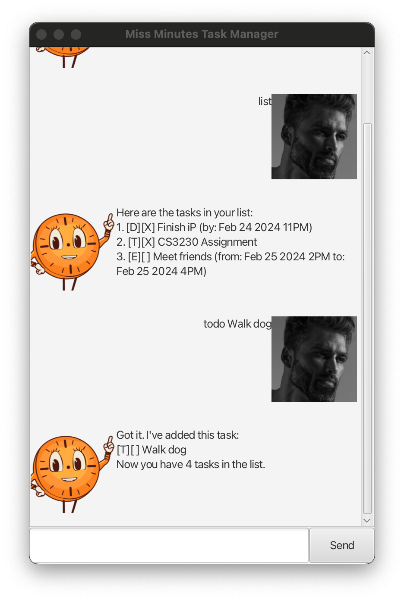

# Miss Minutes User Guide ⏰
Welcome to Miss Minutes, your personal task manager. Miss Minutes is a versatile task manager with a wide range of 
features to help you manage your tasks effectively and to keep you on track for success. Whether it's a simple todo, 
a deadline, or an event, Miss Minutes has got you covered. 💼📆



## Features (batteries included) ⚡
Miss Minutes comes with a wide range of features, 
- ✅ Fine grained task management: Create, list, find, mark, unmark, and delete tasks
- 📅 Multiple task types supported: `todo`, `deadline`, and `event`
- 💽 Persistent storage: Tasks are saved and loaded from disk


>[!warning]
> Please note that the output may vary between the CLI and GUI versions of the application.


Fear not, the Miss Minutes task manager is smart, and will provide you with the correct input format, 
should you make a mistake. 💡


## Creating tasks
There are three types of tasks that can be created: `todo`, `deadline`, and `event`.

### Creating a todo task 📝
To create a todo task, use the `todo` command followed by the task description.

Example usage: `todo Borrow book`

```
Got it. I've added this task: 
[T][ ] borrow book
Now you have 1 tasks in the list.
```

### Creating a deadline task ⏰
To create a deadline task, use the `deadline` command followed by the task description and the deadline in the format `yyyy-mm-dd`.

Example usage: `deadline Return book /by 2024-02-24 1100`

```
Got it. I've added this task: 
[D][ ] Return book (by: Feb 24 2024 11PM)
Now you have 1 tasks in the list.
```

### Creating an event task 📅
To create an event task, use the `event` command followed by the task description and the event date in the format `yyyy-mm-dd`.

Example usage: `event Project meeting /from 2024-02-24 1400 /to 2024-02-24 1500`

```
Got it. I've added this task: 
[E][ ] Project meeting (from: Feb 24 2024 2PM to: Feb 24 2024 3PM)
Now you have 1 tasks in the list.
```

### Listing tasks 📜
To list all tasks, use the `list` command.

Example usage: `list`

```
Here are the tasks in your list: 
1. [T][ ] borrow book
```

### Finding tasks 🔍
To find tasks containing a specific keyword, use the `find` command followed by the keyword.

Example usage: `find dog`

```
Here are the matching tasks in your list:
> 1. [T][] Walk dog
```

### Marking / Unmarking tasks ✅❌
To mark or unmark tasks as done, simply use the `mark` / `unmark` command followed by the task numbers.
Example usage: `mark 1`

```
Nice! I've marked this task as done: 
[T][X] borrow book
```

### Deleting tasks 🗑️
To delete tasks, use the `delete` command followed by the task numbers.

Example usage: `delete 1`

```
Noted. I've removed this task:
[E][X] Meet friends (from: Feb 25 2024 2PM to: Feb 25 2024 4PM)
Now you have 3 tasks in the list.
```